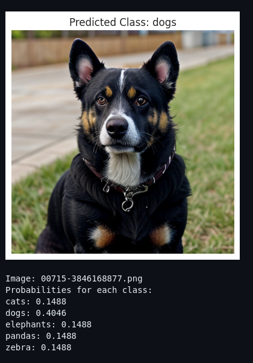

# Proyek Klasifikasi Gambar: Animal (cats,dogs,elephants,pandas,zebra)

Proyek ini bertujuan untuk membangun model deep learning yang mampu mengklasifikasikan gambar ke dalam lima kategori hewan: cats, dogs, elephants, pandas, dan zebra. Proyek ini mencakup seluruh pipeline machine learning, dari pengumpulan dan persiapan data, pelatihan model, hingga konversi model ke format yang dapat digunakan di aplikasi web dan perangkat mobile (TF Lite dan TensorFlow.js).

## Requirements
Semua dependensi disimpan dalam `requirements.txt`

## 1. Library
- `TensorFlow` & `Keras` untuk membangun dan melatih model CNN.
- `Matplotlib`, `Seaborn` untuk visualisasi data.
- `Pillow`, `os`, dan `shutil` untuk pemrosesan file dan gambar.
- `Google Colab` dan `gdown` untuk download dataset dari Google Drive.
- `TensorFlow.js` dan `TFLite` untuk konversi model ke berbagai platform.

## 2. Persiapan Data
1. Unduh dan Ekstrak Dataset
Dataset diunduh dari Google Drive dalam format ZIP dan diekstrak ke direktori ./dataset/. Struktur folder berisi subfolder untuk tiap kelas nama hewan.
2. Visualisasi Distribusi Gambar
Jumlah gambar untuk setiap kelas divisualisasikan menggunakan seaborn.countplot() untuk memastikan distribusi dataset seimbang.
3. Jumlah Dataset per Kelas:
- Gambar cats memiliki 2530 gambar.
- Gambar dogs memiliki 2539 gambar.
- Gambar elephants memiliki 2483 gambar.
- Gambar pandas memiliki 2460 gambar.
- Gambar zebra memiliki 2313 gambar.

## 3. Preprocessing Data
Dataset dibagi menjadi tiga bagian:
- Training (60%)
- Validation (20%)
- Testing (20%)

## Arsitektur Model CNN
Model Convolutional Neural Network dibangun menggunakan Sequential() Keras dengan konfigurasi sebagai berikut:
- 6 buah `Conv2D` layer bertingkat dari 32 -> 512 filter.
- `BatchNormalization` setelah tiap convolution untuk stabilisasi training.
- `MaxPooling2D` untuk downsampling.
- `Dropout` dan `Dense` layer di akhir untuk mencegah overfitting.
- Output layer menggunakan `softmax` dengan 5 unit (untuk 5 kelas).

## Training Model
1. Augmentasi data dilakukan dengan ImageDataGenerator:
- Rotasi, flip horizontal/vertikal, zoom, shear, brightness adjustment, dll.
- Model dilatih menggunakan optimizer Adam dan fungsi loss categorical_crossentropy.

2. Callback yang Digunakan:
- `EarlyStopping` untuk menghentikan pelatihan saat tidak ada peningkatan.
- `ReduceLROnPlateau` untuk menurunkan learning rate saat model stagnan.
- `ModelCheckpoint` untuk menyimpan model terbaik.
- `Custom callback` untuk menghentikan pelatihan jika akurasi mencapai >95%.

## Evaluasi Model
Visualisasi akurasi dan loss dari pelatihan ditampilkan dengan matplotlib

## Konversi Model
Model dikonversi ke tiga format berbeda:
- `SavedModel`: untuk digunakan langsung di TensorFlow.
- `TFLite`: untuk digunakan di perangkat mobile (Android/iOS).
- `TensorFlow.js`: untuk digunakan di aplikasi web browser.

## Inference

